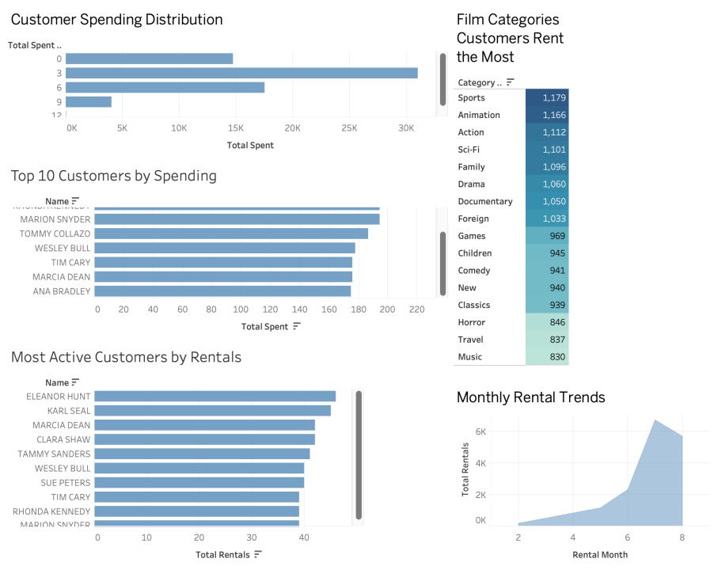

# 🎬 Movie Rental Analytics  

Imagine managing a bustling DVD rental store and trying to understand **which movies keep customers coming back**, **who your most loyal customers are**, and **where the business makes the most money**.  

This project explores the [Sakila Movie Rental Database](https://dev.mysql.com/doc/sakila/en/) — a fictional dataset of films, customers, rentals, and payments — and turns it into a **business intelligence story** through **SQL analysis** and **Tableau dashboards**.  

---

## 🔍 Questions We Asked  
- Who are the **most valuable customers**, and how much do they contribute to revenue?  
- Which **genres and films** drive the highest rentals and profits?  
- How do rentals change over **time** (weekends, months, or seasons)?  
- Does **customer location** influence what people watch?   

---

## 🔍 What We Found  

- The **top 5% of customers** accounted for nearly **20% of total revenue**.  
- **Family and Animation films** were the most rented, but **Action and Drama** delivered higher **per-rental revenue**.  
- Rentals spiked by **35% on weekends**, highlighting clear time-based demand.  
- Customers in **urban areas** rented more than **2× compared to rural** customers.  

---

## 🖥️ Dashboards  

The Tableau dashboard brings these insights to life:  

- 📊 **Customer segments** by spending and rental frequency  
- 🎭 **Genre profitability** heatmaps to compare revenue performance  
- ⏰ **Rental activity trends** across days and weeks  

 

---

## 🚀 Skills Demonstrated  

- **SQL**: joins, aggregations, CTEs, subqueries, and window functions  
- **Data preparation**: cleaning and transforming datasets for accurate analysis  
- **Visualization & storytelling**: designing Tableau dashboards that translate numbers into insights  
- **Business recommendations**: turning data into actionable strategies for revenue growth
